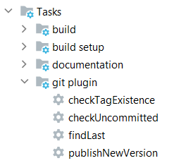

# Git Gradle Plugin

Автор: Диана Харлап

## Сборка проекта

Для подготовки плагина к использованию достаточно выполнить одну команду:

```
gradle publishToMavenLocal
```

В результате выполнения сборка плагина будет опубликована в локальном репозитории Maven.

## Подключение проекта

Для подключения плагина в свой проект в *build.gradle* необходимо вставить следующие строки кода:

```groovy
plugins {
    id 'by.harlap.gitplugin' version '1.0.0'
    // другие плагины 
}

repositories {
    mavenLocal()
    // другие репозитории
}
```

Также следующие строки необходимо добавить **в самое начало** файла *settings.gradle*:

```groovy
pluginManagement {
    repositories {
        mavenLocal()
        gradlePluginPortal()
        mavenCentral()
    }
}
```

# Применение проекта

Четыре Gradle-задачи находятся в пакете **git plugin**



### Проверить наличие тега

Задача проверяет наличие тега у текущего состояния проекта:

```
gradle checkTagExistence
```

### Проверить наличие несохранённых изменений

Задача проверяет, все ли изменения были закоммичены:

```
gradle checkUncommitted
```

### Найти последний тег

Задача ищет последний тег:

```
gradle findLast
```

### Опубликовать новую версию проекта

Задача добавляет новый тег и публикует изменения с данным тегом в удалённый репозиторий (origin).

Для этого задача сама запускает три предыдущие задачи, и только в случае их успешного завершения исполняется сама.

```
gradle publishNewVersion
```

# Описание проекта

1. Плагин должен добавить задачу в проект
2. В зависимости от того, в какой ветке задача была запущена
    1. Определить последнюю опубликованную версию  (последний git tag)
    2. Определить версию текущего билда исходя из следующей логики
        - dev/qa - инкремент минорной версии
        - stage - добавить постфикс -rc
        - master - инкремент мажорной версии
        - Из любой другой ветки - постфикс -SNAPSHOT
    3. Присвоить соответствующий git tag
    4. Опубликовать его в origin

* Если текущему состоянию проекта уже присвоен git tag, новый присваиваться не должен
* Если в рабочей директории есть незакоммиченные изменения, вывести в лог номер сборки с постфиксом .uncommitted, git
  tag при этом не создавать
